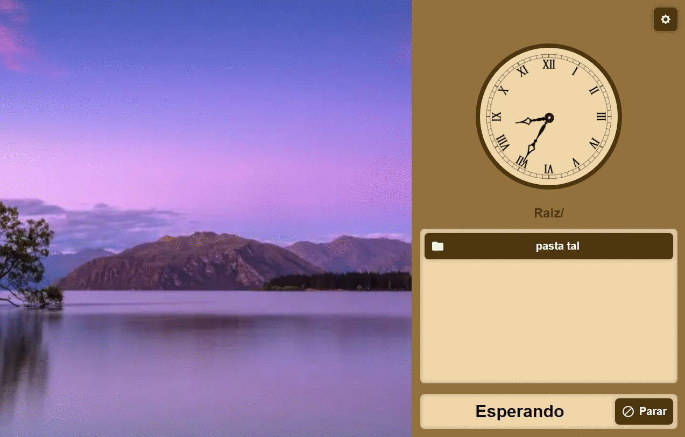

<div align="center">
  
  <h1>doom</h1>
</div>

## 💻 O projeto
Este projeto tem como objetivo auxiliar paróquias com toque de sinos e músicas de forma manual ou programática.

## 🔧 Funcionalidades
- Relógio analógico
- Adicionar, remover, reproduzir e parar músicas
- Tocar músicas de forma programática

## 🧪 Tecnologias principais

<p align="center">
  <a href="https://pt-br.reactjs.org/">
    
  </a>
  <a href="https://www.electronjs.org/">
    
  </a>
</p>

## 📸 Capturas de tela


## 🎨 Design
O design do projeto pode ser encontrado [aqui](https://www.figma.com/file/Ak7Gc5F5NV3a9PlPFvZB8w/DOOM)

## 🚀 Como executar
Clone o projeto e acesse a pasta do mesmo.
```
$ git clone https://github.com/Jonatan966/doom
$ cd doom
```
Para iniciá-lo, siga os passos abaixo:
```
# Instalar as dependências
$ yarn

# Iniciar o projeto
$ yarn start
```

Para gerar um executável do projeto, basta seguir o seguinte passo:
```
$ yarn package
```

## 📝 Licença
Este projeto está sob a licença MIT. Veja o arquivo [LICENSE](./LICENSE) para mais detalhes.